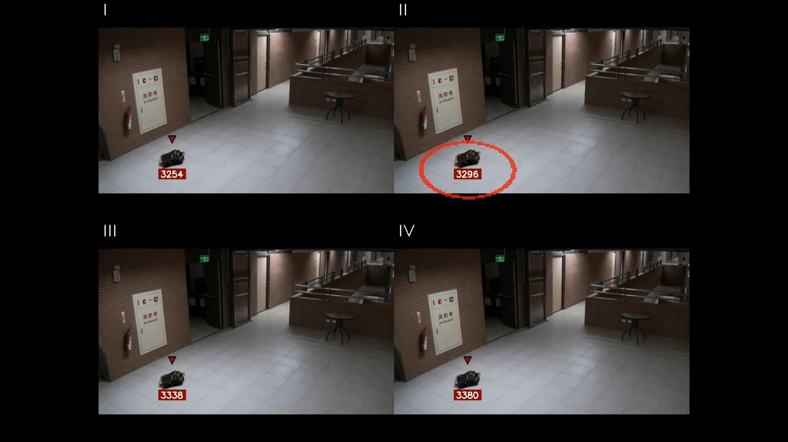
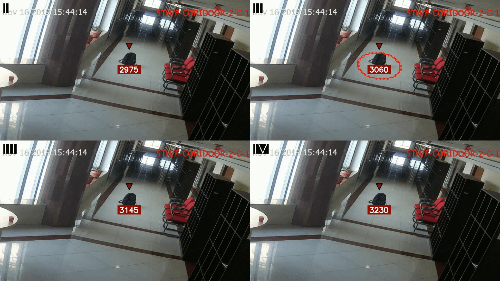

# abandoned_objects

In our project, we were engaged in detecting abandoned items using YOLOv5 and ByteTracker. To use our project, just follow the link to Google Colab or download a notebook and upload it to Google Colab, and everything: weights, all the necessary repositories will be downloaded. 

Results:

### References
- https://github.com/ultralytics/yolov5
- https://github.com/HanGuangXin/ByteTrack_ReID

## Authors
- [Roman Yushchev](https://github.com/r0mz32)
- [Ivan Solodovnikov](https://github.com/vagagabun)
