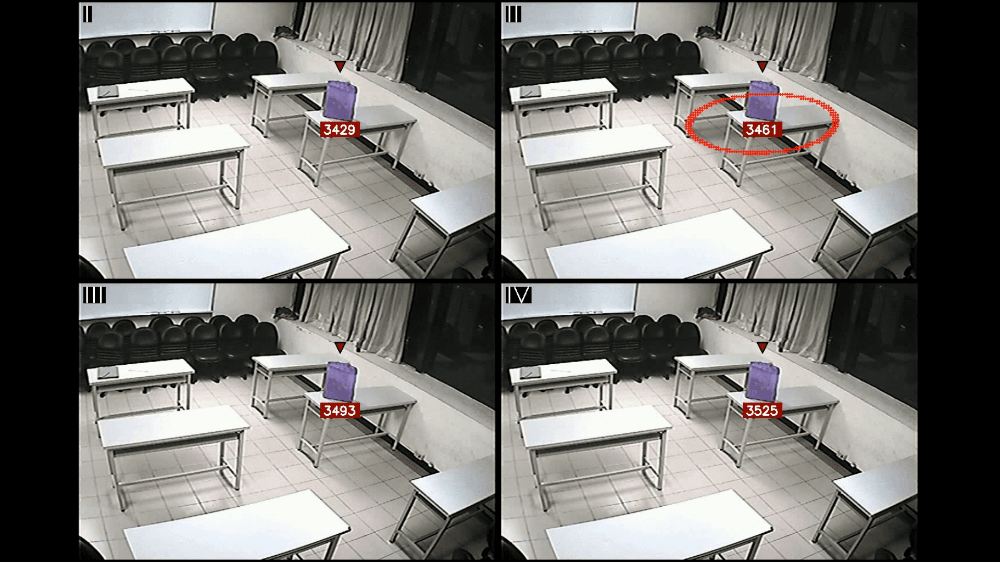

# abandoned_objects

In our project, we were engaged in detecting abandoned items using YOLOv5 and ByteTracker. To use our project, just follow the link to Google Colab or download a notebook and upload it to Google Colab, and everything: weights, all the necessary repositories will be downloaded. 
- [Google Colab notebook](https://colab.research.google.com/drive/1NnACXfjYAxKmw8ipbCNt2u_Blu_SG6ne?usp=sharing#scrollTo=MDpLr8GoAKdU)

Link to the dataset on which we taught the detector using YOLOv5:
- [Roboflow](https://app.roboflow.com/lab-wjdgh/abandoned-objects-kc8ty/overview)

Results:

### References
- https://github.com/ultralytics/yolov5
- https://github.com/HanGuangXin/ByteTrack_ReID
- https://github.com/roboflow/notebooks/blob/main/notebooks/how-to-track-football-players.ipynb

## Authors
- [Roman Yushchev](https://github.com/r0mz32)
- [Ivan Solodovnikov](https://github.com/vagagabun)
